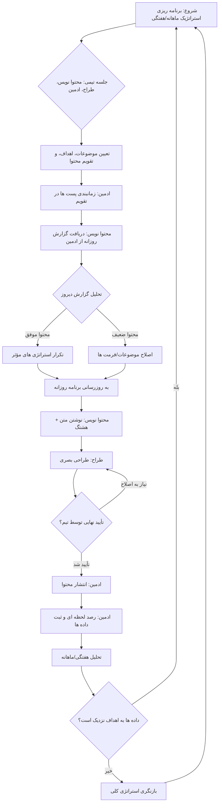

```mermaid
flowchart TD
    A[شروع: برنامه ریزی استراتژیک ماهانه/هفتگی] --> B{جلسه تیمی: محتوا نویس، طراح، ادمین}
    B --> C[تعیین موضوعات، اهداف، و تقویم محتوا]
    C --> D[ادمین: زمانبندی پست ها در تقویم]
    D --> E[محتوا نویس: دریافت گزارش روزانه از ادمین]
    E --> F{تحلیل گزارش دیروز}
    F --> |محتوا موفق| G[تکرار استراتژی های مؤثر]
    F --> |محتوا ضعیف| H[اصلاح موضوعات/فرمت ها]
    G & H --> I[به روزرسانی برنامه روزانه]
    I --> J[محتوا نویس: نوشتن متن + هشتگ]
    J --> K[طراح: طراحی بصری]
    K --> L{تأیید نهایی توسط تیم؟}
    L --> |تأیید شد| M[ادمین: انتشار محتوا]
    L --> |نیاز به اصلاح| K
    M --> N[ادمین: رصد لحظه ای و ثبت داده ها]
    N --> O[تحلیل هفتگی/ماهانه]
    O --> P{داده ها به اهداف نزدیک است؟}
    P --> |بله| A
    P --> |خیر| Q[بازنگری استراتژی کلی]
    Q --> A
```
